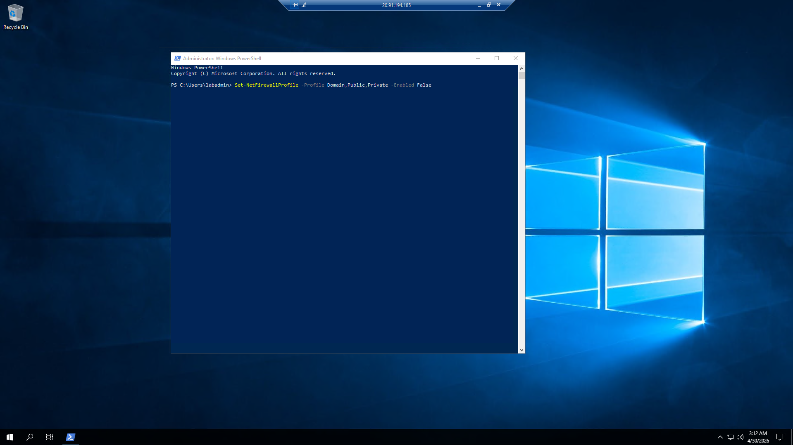
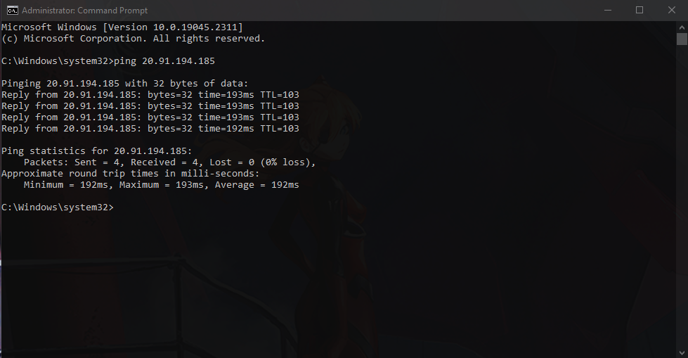
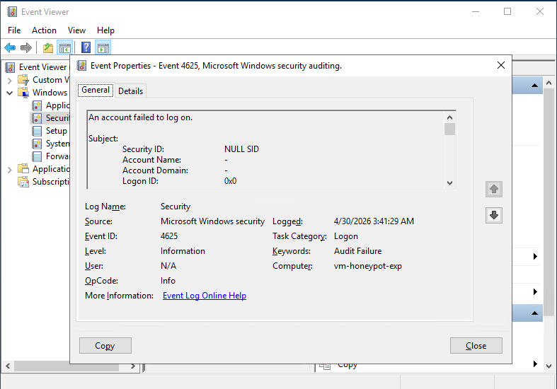

#  Azure Sentinel (SIEM) SOC Lab: Live Attack Monitoring
   


##  Project Overview

This project demonstrates the implementation of a cloud-native **Security Operations Center (SOC)** and a targeted **Honeypot** environment. I provisioned a Windows Virtual Machine in **Sweden Central**, intentionally exposed to the internet to attract and analyze real-world RDP brute-force attacks. Telemetry is ingested into a **Log Analytics Workspace** and visualized using **Microsoft Sentinel (SIEM)** via custom KQL queries.

##  Objectives
*   **Asset Provisioning:** Deploy a vulnerable cloud instance to serve as a telemetry source.
*   **Pipeline Configuration:** Establish a log ingestion pipeline using the **Azure Monitor Agent (AMA)** and Data Collection Rules (DCR).
*   **Threat Intelligence:** Utilize **Kusto Query Language (KQL)** to perform IP geolocation and visualize attack origins.
*   **Incident Analysis:** Analyze raw security events (Event ID 4625) to understand attacker behavior and TTPs.

##  Technologies & Tools
| Component | Technology |
| :--- | :--- |
| **SIEM** | Microsoft Sentinel |
| **Log Management** | Log Analytics Workspace |
| **Cloud Provider** | Microsoft Azure (VM, Networking, NSG) |
| **Telemetry** | Windows Event Viewer (Event ID 4625) |
| **Query Language** | KQL (Kusto Query Language) |
| **Automation** | PowerShell |
##  Implementation Steps

### 1. Honeypot Exposure (Firewall Deactivation)
To ensure the Honeypot was visible to automated internet scanners, I utilized PowerShell to disable all local firewall profiles. This allowed ingress ICMP and RDP traffic to reach the OS for telemetry collection.


### 2. Global Visibility Validation
Verified global visibility by performing ICMP echo requests (Ping) from a remote terminal to the public IP of the instance located in **Sweden Central**.


### 3. SIEM Log Ingestion & Raw Telemetry
Configured the Azure Monitor Agent (AMA) to stream raw security events. Below is an example of an **Event ID 4625 (Audit Failure)** captured, showing a malicious actor attempting to brute-force administrative credentials.


##  4. Threat Intelligence & Data Analytics

<p align="center">
  
  
</p>

<p align="center">
  <em>Figure 1: Side-by-side comparison of Global Attack origins (Left) and Quantitative Source Analysis (Right).</em>
</p>

##  Technical Artifacts: KQL Threat Hunting


#### 1. Map Geolocation Logic
This query extracts physical coordinates from raw IP data to populate the interactive global dashboard.

```kql
SecurityEvent
| where EventID == 4625
| extend Location = geo_info_from_ip_address(IpAddress)
| extend Country = tostring(Location.country), 
         Latitude = toreal(Location.latitude), 
         Longitude = toreal(Location.longitude)
| summarize EventCount = count() by IpAddress, Country, Latitude, Longitude
```

#### 2. Analytical Distribution Logic
This query aggregates total attack volume by country, specifically handling "In-Processing" telemetry to ensure data integrity in the Pie Chart.

```kql
SecurityEvent
| where EventID == 4625
| extend CountryInfo = geo_info_from_ip_address(IpAddress).country
| extend Country = iif(isempty(tostring(CountryInfo)), "Infiltrating / Processing", tostring(CountryInfo))
| summarize TotalAtaques = count() by Country
| sort by TotalAtaques desc
```
